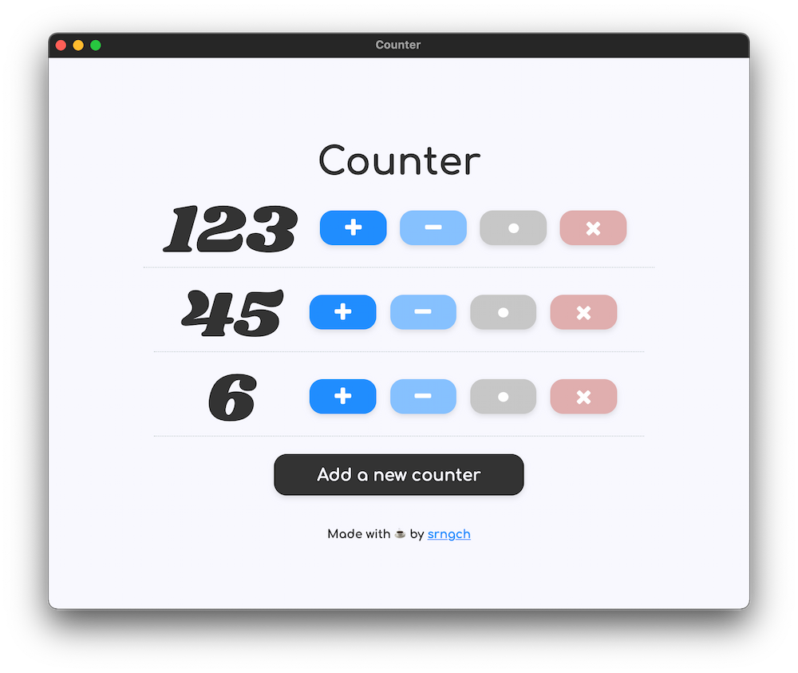

# Counter

A simple counter app for learning Class Syntax in vanilla JavaScript.

## Todo
- [x] Add multiple counters.
- [x] Apply an icon to buttons.
- [x] Set meta tags including Open Graph.
- [ ] Compiling using the [Babel](https://babeljs.io/).

## Preview

